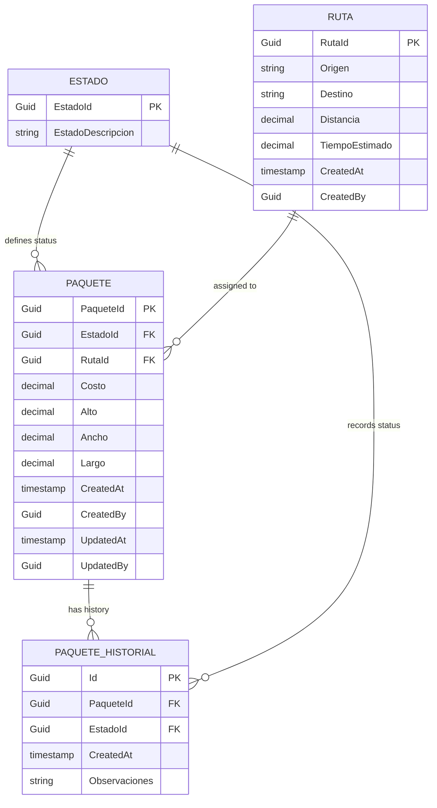
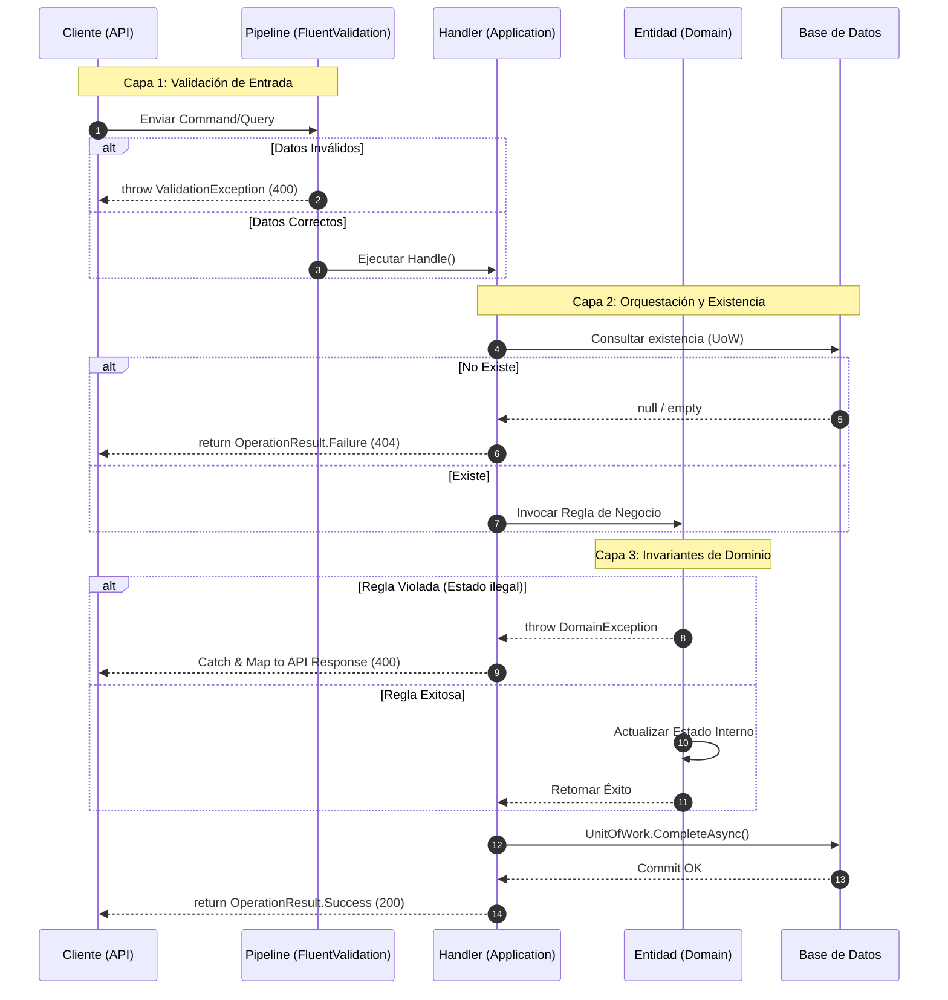
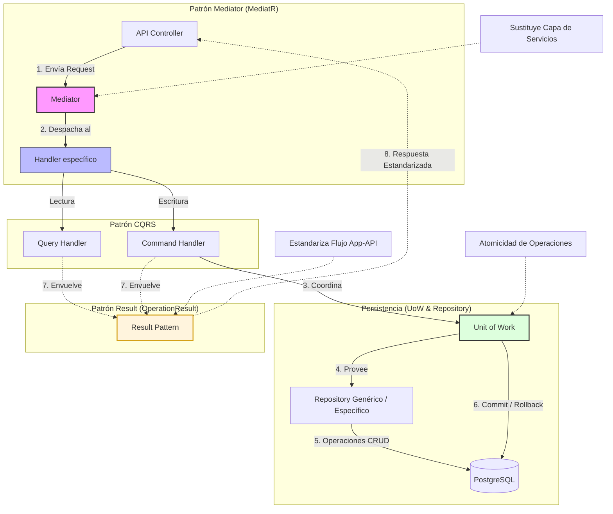

# Decisiones de Diseño

## 1. Estructura del Dominio
[¿Cómo modelaste las entidades? ¿Por qué?]
```bash
#  Para la parte de la lógica se aprovecho el espacio que existia del Middleware para evaluar Excepciones de domminio y
# validar dentro de la entidad algunas de las validaciones referentes a las reglas de negocio con ello las entidades permanecen
# sin saber que existe un Http o WebAPI

```




## 2. Ubicación de Reglas de Negocio  
[¿Dónde pusiste las validaciones y por qué?]
```bash
# Validaciones de Entrada - [Application - FLuentValidation] (apoyado de la IPipelineBehaivor para cada campo)
# Reglas de Estado e Invariantes [Domain - Entities] (validaciones internas con excepcionDomain)
# Validaciones de exitencia [Application - Handlers] (Orquestción de existencia de objetos en BD con UoW)
```




## 3. Patrones Utilizados
[¿Qué patrones aplicaste? ¿Cuál fue tu razonamiento?]
```bash
#  1. Repository .- Estructura las operaciones genericas para CRUD de catálogs adenmas de crear una estructura que prepara el UoW

#  2. CQRS .- Separación de las operaciones de lectura y escritura

#  3. Mediator .- Desacopla los controladores de la lógica de negocio ( sustituye a la capa se servicios)

#  4. UnitOfWork .- Permite la atomicidad para mantener varias operaciones en la BD simulando incluso COMMITS, ROLLBACKS

#  4. Result Patter .- Estructura el flujo normal del programa para la estenderización entre la capa de aplicación y de presentación

```





## 4. Trade-offs y Limitaciones
[¿Qué dejaste fuera por tiempo? ¿Cómo lo resolverías?]
```bash
#  1. Pruebas .- Termine la estrucutra, arquitectura, diseño y programación pero no realice pruebas funcionales con Postman o alguna herramienta que realice 
# peticiones a mi servicio backend.

# 2. Validar todas las pruebas unitarias .- Aunque de las pruebas que agregue pasaron la mayoria hubo algunas que me hubiera gustado terminar con apoyo de las
# herramientas de debug para las pruebas

# 3. Hubo algunas operaciones LINQ que no termine de implementar

# 4. UI .- Aunque no venía en la parte del requrimiento agregar una pequeña interfaz que apoye el registro, actualización y visualizción de paquetes con apoyo
# de una libreria como React para que el desarrollo se mas ágil y podamos interactuar visualmente con los recursos del api.

```

## 5. Supuestos
[¿Qué asumiste que no estaba explícito en los requerimientos?]
```bash
# A nivel programación el proyecto contaba con todo lo necesario para realizar la implementación sin embargo las estructuras para aplicar el CQRS no se veían
# pero se podia intuir que con las librerias y patrones aplicados ese era el camino que había que tomar

# En lo que respecta a la cadena de conexión que se comparte entre Docker y el modo Development local, se tiene que utilizar variables de entorno dentro
# del compose para al api backend

# Se define que el uso y dinamica con la BD será code first ya que se necesitaron crear primero las entidades y configurar el DbContext.cs

```