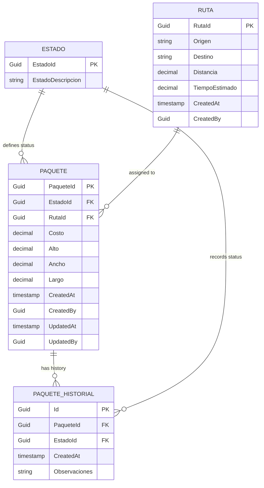
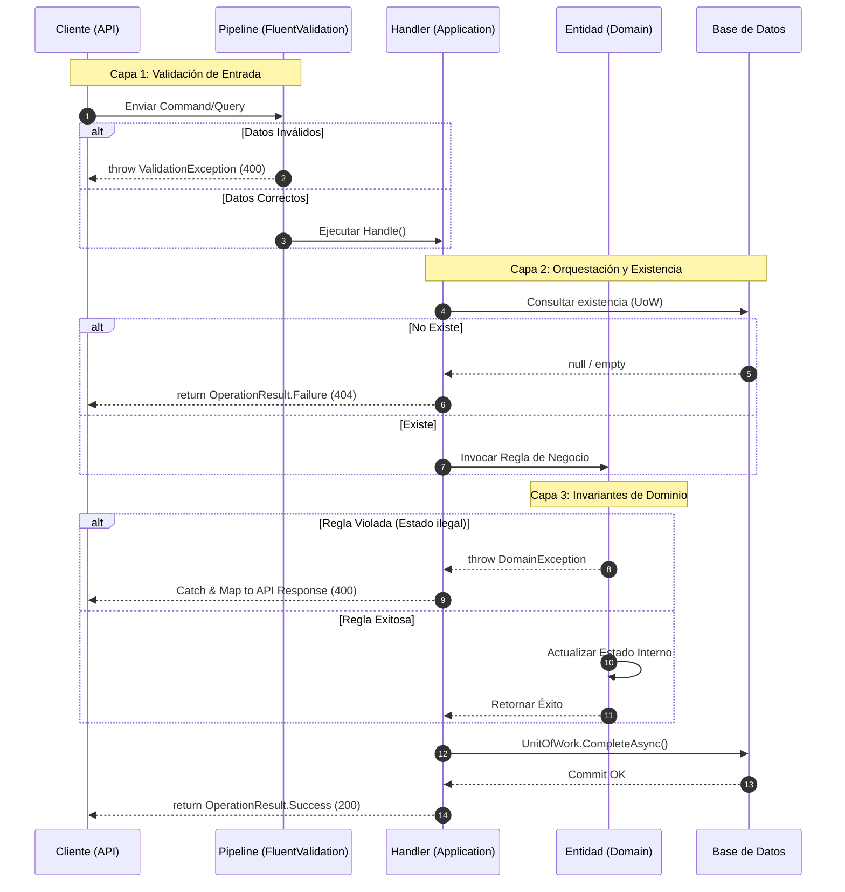
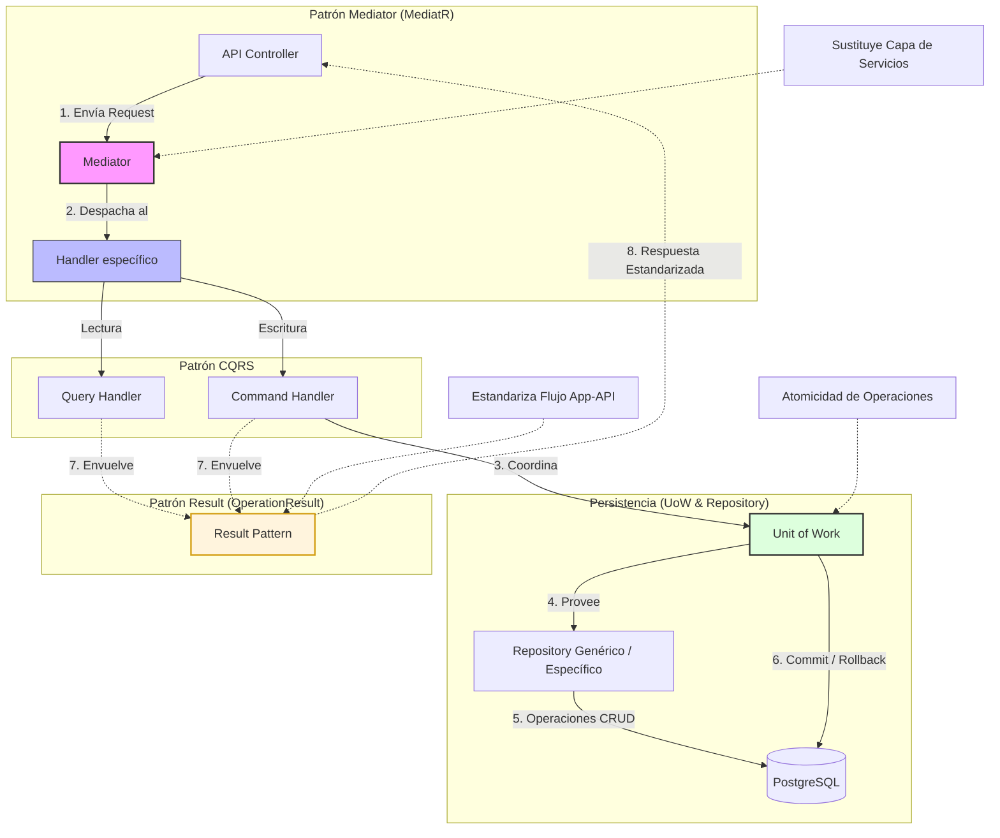

# Decisiones de Diseño

## 1. Estructura del Dominio
[¿Cómo modelaste las entidades? ¿Por qué?]
```bash
#  Para la parte de la lógica se aprovecho el espacio que existia del Middleware para evaluar Excepciones de domminio y
# validar dentro de la entidad algunas de las validaciones referentes a las reglas de negocio con ello las entidades permanecen
# sin saber que existe un Http o WebAPI

```




## 2. Ubicación de Reglas de Negocio  
[¿Dónde pusiste las validaciones y por qué?]
```bash
# Validaciones de Entrada - [Application - FLuentValidation] (apoyado de la IPipelineBehaivor para cada campo)
# Reglas de Estado e Invariantes [Domain - Entities] (validaciones internas con excepcionDomain)
# Validaciones de exitencia [Application - Handlers] (Orquestción de existencia de objetos en BD con UoW)
```




## 3. Patrones Utilizados
[¿Qué patrones aplicaste? ¿Cuál fue tu razonamiento?]
```bash
#  1. Repository .- Estructura las operaciones genericas para CRUD de catálogs adenmas de crear una estructura que prepara el UoW

#  2. CQRS .- Separación de las operaciones de lectura y escritura

#  3. Mediator .- Desacopla los controladores de la lógica de negocio ( sustituye a la capa se servicios)

#  4. UnitOfWork .- Permite la atomicidad para mantener varias operaciones en la BD simulando incluso COMMITS, ROLLBACKS

#  5. Result Pattern .- Estructura el flujo normal del programa para la estenderización entre la capa de aplicación y de presentación

#  6. Strategy Pattern .- Para el manejo global de excepciones se provee y contemplan los diferentes tipos de excepciones a nivel
# dominio, aplicación o lógica de negocio

# 7. FactoryPattern.- Para el caso de los errores / excepciones se delega la creación de la plantilla de respuesta de errors a ProblemDetailFactory para que construya esa respuesta

```





## 4. Trade-offs y Limitaciones
[¿Qué dejaste fuera por tiempo? ¿Cómo lo resolverías?]
```bash
#  1. Paginación .- Se me paso agregar este punto, sé que tengo que utilizar el SpecificationPattern con la interfaz ISpecification

```

## 5. Supuestos
[¿Qué asumiste que no estaba explícito en los requerimientos?]
```bash
# A nivel programación el proyecto contaba con todo lo necesario para realizar la implementación sin embargo las estructuras para aplicar el CQRS no se veían
# pero se podia intuir que con las librerias y patrones aplicados ese era el camino que había que tomar

# En lo que respecta a la cadena de conexión que se comparte entre Docker y el modo Development local, se tiene que utilizar variables de entorno dentro
# del compose para al api backend

# Se define que el uso y dinamica con la BD será code first ya que se necesitaron crear primero las entidades y configurar el DbContext.cs

# Se identificó que las interfaces que se encontraban dentro de la capa de Application deben de ir dentro de Entities para respetar CLEAN

# Para el caso de la configuración técnica (localizer) se tuvo que mover a la capa de infraestructura para seguir respetando CLEAN

# Dentro del wrapper de Excepciones se deben agregar las excepciones que vayan surgiendo, ya se encontraban las DomainException, ValidationException pero quedaba pendiente las NotFoundException

```

## 6. Mejoras de Docker (Opcional)

| Área                   | Pregunta guía                                   | Optimización                                                                        |
| ---------------------- | ----------------------------------------------- |-------------------------------------------------------------------------------------|
| Optimización de imagen | ¿Cómo reducirías el tamaño de la imagen final?  | Con image alpine o chiseled                                                         |
| Seguridad              | ¿Qué usuario ejecuta el proceso? ¿Es root?      | No para el caso de la imagen chiseled es non-root                                   |
| Cache de capas         | ¿El orden de COPY aprovecha el cache de Docker? | Si, se debe de cuidar que las etapas que menos sufran cambios vayan hasta arriba    |
| Health checks          | ¿Cómo sabría Docker si la API está saludable?   | Existe una configuración "healthcheck que realiza esa tarea para reintentar accesos |
| Ambiente completo      | ¿Cómo levantarías API + BD juntos?              | Dentro del compose se agrega el servicio de la API y setea el depends: db           |

